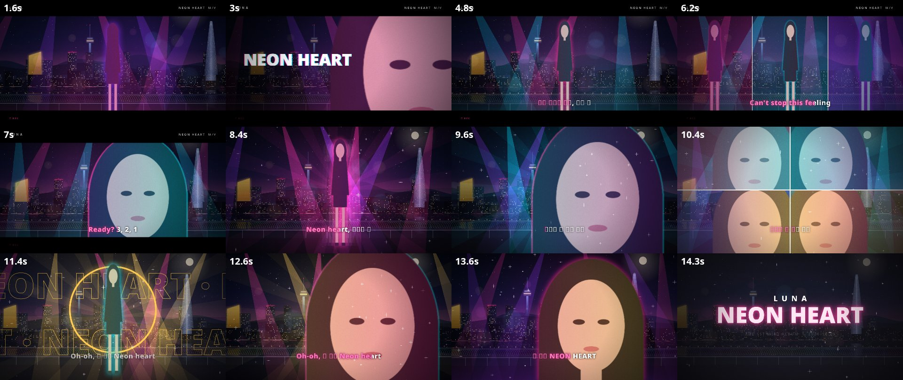

# NEON HEART — 15초 K-POP 뮤직비디오 쇼릴

서울 야경을 배경으로 한 15초 K팝 뮤직비디오 쇼릴입니다. 128BPM 비트, 노래방식 가사 자막, 비트에 맞춘 컷 전환이 들어 있습니다.

## 파일

| 파일 | 설명 |
|---|---|
| [`index.html`](index.html) | 쇼릴 본체. 크롬/엣지에서 열어 이미지·노래를 넣고 MP4로 저장 |
| [`neon-heart-mv-light.mp4`](neon-heart-mv-light.mp4) | 샘플 영상 · 1920×1080 · 30fps · 6.4MB |
| [`sample-silhouette-15s.mp4`](sample-silhouette-15s.mp4) | 샘플 영상 고화질 · 1920×1080 · 60fps · 30MB |

샘플 영상에는 임시 실루엣이 들어 있습니다.

## 내 인물·노래로 영상 만들기

1. `index.html`을 받아 PC의 크롬 또는 엣지로 엽니다.
2. **🖼 이미지 선택**으로 인물 이미지를 넣습니다. 정면·뒷모습·클로즈업 3컷 캐릭터 시트는 자동으로 나뉘고 회색 배경이 제거됩니다.
3. (선택) **🎵 노래 파일 선택**으로 보컬이 있는 MP3/WAV/M4A를 넣습니다.
4. (선택) **✏️ 가사 자막 편집**에서 `시작초 끝초 가사` 형식으로 자막을 고칩니다.
5. 화질을 고르고 **⬇ MP4 다운로드**를 누릅니다. 고화질은 약 1분 15초가 걸립니다.

## 참고

- 샘플 영상의 소리는 Opus 형식이라 아이폰/QuickTime에서는 소리가 안 날 수 있습니다. 크롬, VLC에서는 정상 재생됩니다.
- 서울 야경은 실제 사진이 아니라 코드로 그린 일러스트입니다.
